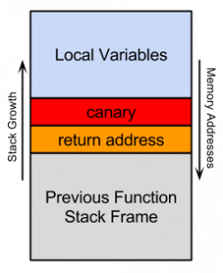
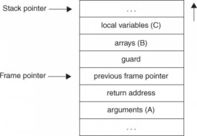
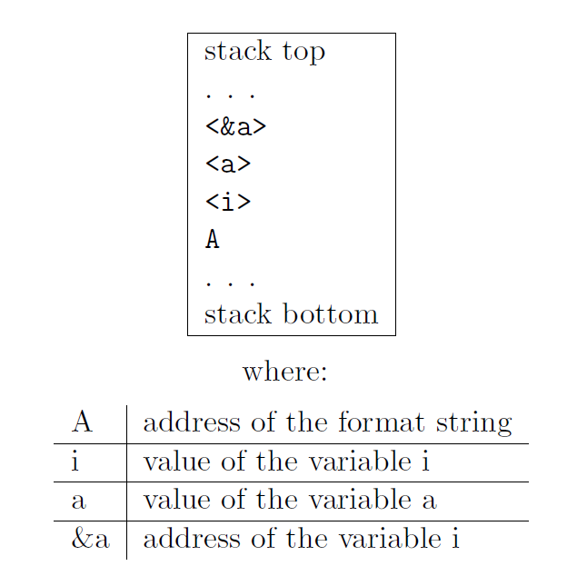
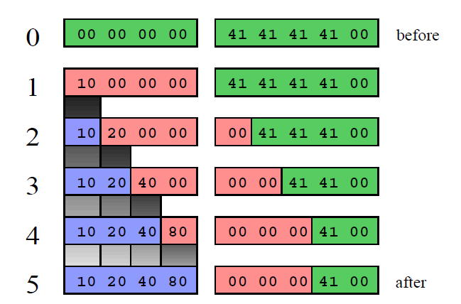

# Information Leaks

## Table of Contents	
   * [Tutorials](#tutorials)
      * [Stack Protection (Canaries)](#stack-protection-canaries)
         * [StackGuard](#stackguard)
         * [StackShield](#stackshield)
         * [ProPolice](#propolice)
         * [Defeating Canaries](#defeating-canaries)
      * [Format String Exploits](#format-string-exploits)
         * [Format functions](#format-functions)
            * [Use of format functions](#use-of-format-functions)
               * [Functionality](#functionality)
               * [How the format function works](#how-the-format-function-works)
               * [The calling function](#the-calling-function)
            * [What exactly is a format string](#what-exactly-is-a-format-string)
         * [The stack and its role at format strings](#the-stack-and-its-role-at-format-strings)
         * [What do we control?](#what-do-we-control)
         * [Crash of the program](#crash-of-the-program)
         * [Viewing the stack](#viewing-the-stack)
         * [Viewing memory at any location](#viewing-memory-at-any-location)
         * [Exploitation - through pure format strings](#exploitation---through-pure-format-strings)
         * [A general method to exploit format strings vulnerabilities](#a-general-method-to-exploit-format-strings-vulnerabilities)
         * [Direct Parameter Access](#direct-parameter-access)
         * [Generalizing format string exploits](#generalizing-format-string-exploits)
   * [Challenges](#challenges)
      * [Challenge 1](#challenge-1)
      * [Challenge 2](#challenge-2)
      * [Challenge 3 - Format Strings](#challenge-3---format-strings)

## Tutorials

### Stack Protection (Canaries)

The name comes from canaries (birds) that were used by mining workers when entering mines and were affected by any deadly gases such as methane before humans were. In our case, stack canaries are used to check if a buffer overflow of a stack variable resulted in overriding the return address. The mechanism is based on a (sometimes random) value that is placed on each function's stack, just above the return address, as the following picture shows. The value is checked in the function's epilogue before calling ret, and if the values do not match the execution is halted. Since the stack grows from higher memory addresses to lower ones, any buffer overflow targeting the return address will also have to overwrite the canary with the right value.



There are 3 main variations of this mechanism: random, terminator, and random XOR.

`Random` canaries are generated when programs start, and are stored in a global variable. The global variable can be located in a memory region surrounded by unmapped pages - this protects against information leak attacks (see next section) that dump big memory chunks, since accessing the unmapped pages will trigger a segmentation fault. This first method is a little bit hard to implement because the `crt0.o` code (see note below) has to read `/dev/random`.

The `terminator` canaries contain string termination characters such as `0x00`, `CR`, `LF`, or `-1`. This is based on the assumption that most buffer overflows happen when string manipulation functions (e.g., `strcpy()`) are called with bad arguments. One would want to leak the canary value and then use a buffer overflow to overwrite it with the same value. Because string manipulation functions usually stop when termination characters are encountered, it is difficult to use them to overwrite the same value (containing termination characters) over the canary.

The `random XOR` canaries work by applying a XOR-based algorithm having both a random number (the canary), and the correct address as inputs. The attacker has to both obtain the random number, and apply the algorithm on the new return address before building the payload.

> `crt0.o` is a set of initialization routines linked into compiled C programs, and executed before calling `main()`. [More details](https://en.wikipedia.org/wiki/Crt0)

The 3 well known implementations of stack protections are: `StackGuard`, `ProPolice`, and `StackShield`.

#### StackGuard

The [initial implementation](https://www.usenix.org/legacy/publications/library/proceedings/sec98/full_papers/cowan/cowan_html/cowan.html) proposed by Crispin Cowan et al. from Immunix Inc., only protected the return address by pushing the canary value on the stack right after it (at lower adresses in memory, just like in the picture). Follow-up versions also protected the saved registers and base pointer. StackGuard is implemented as a patch for the GCC compiler that modifies the GCC's code generation routines for function prologues and epilogues. The prologue will push the random value onto the stack, while the epilogue will contain a short value checking code.

>[Presentation](https://courses.cs.washington.edu/courses/cse504/10sp/Slides/lecture3.pdf) on the history of StackGuard by Crispin Cowan.

#### StackShield

The most notable feature of StackShield, compared to other implementations, is the Global Return Stack. This is a separate memory structure where return addresses are pushed as function are being called. When the function returns, the correct value is copied back to the application stack, thus overriding any malicious value. Ret Range Check is another feature that allows stack smashing detection by copying return addresses from the application stack to a memory region with no write permission - the value is compared to the current return address in function's epilogue.

#### ProPolice

ProPolice, proposed by IBM, started from an implementation similar to StackGuard, but evolved and introduced new features. It is currently the method used by GCC when the `--fstack-protector` compilation flag is used. The ProPolice mechanism will reorder local variables based on their types. The following picture shows where each variable should be placed on the stack based on it's type such that different attacks become impossible.



> GCC supports 3 levels of stack smashing protection: complete, normal, and strong. The difference lies in the types of function that are protected, with the decision being made by looking at what kinds of local variables are used. Details in [this](https://lwn.net/Articles/584225/) LWN article.

```c
void func() {
    char buffer[1337];
    return;
}
 
int main() {
    func();
    return 0;
}
```

Compile the file using:

```
~$ CFLAGS='-O0 -m32 -fstack-protector' make ssp
```

The disassembled code for `func()` looks like this:

```
~$ objdump -M intel -d -j .text ./ssp
```

```
0804841b <func>:
 804841b:	55                   	push   ebp
 804841c:	89 e5                	mov    ebp,esp
 804841e:	81 ec 48 05 00 00    	sub    esp,0x548
 8048424:	65 a1 14 00 00 00    	mov    eax,gs:0x14
 804842a:	89 45 f4             	mov    DWORD PTR [ebp-0xc],eax
 804842d:	31 c0                	xor    eax,eax
 804842f:	90                   	nop
 8048430:	8b 45 f4             	mov    eax,DWORD PTR [ebp-0xc]
 8048433:	65 33 05 14 00 00 00 	xor    eax,DWORD PTR gs:0x14
 804843a:	74 05                	je     8048441 <func+0x26>
 804843c:	e8 af fe ff ff       	call   80482f0 <__stack_chk_fail@plt>
 8048441:	c9                   	leave  
 8048442:	c3                   	ret 
```

We can observe the random value being read from `gs:0x14` and placed on the stack after the return value. Let's take a look at this in GDB for multiple runs. Start by creating a small GDB script that can be easily executed multiple times.

```gdb
set disassembly-flavor intel
file ssp
break *0x804842a
commands
p/x $eax
c
end
run
quit
```

Run using:

```
~$ gdb -x canary.gdb ssp
```

#### Defeating Canaries

This [white paper](https://www.blackhat.com/presentations/bh-usa-04/bh-us-04-silberman/bh-us-04-silberman-paper.pdf) covers different attack vectors and the capabilities of protecting against these offered by the 3 implementations that we previously presented. As the paper presents, there are multiple target values that an attacker might want to modify during exploitation, by overflowing buffers stored in different regions of the process.

For example, the attacker might target:
* parameters function pointers (pushed onto the stack before calling functions)
* the return address
* the old base pointer
* a plain function pointer (local variable)

Buffers could be stored either on the `stack`, the `heap` or `.bss` section.

>Note that attacks can also be carried out via indirect pointers. The attacker could target a stack local variable, without trying to change the return value, that is later used as a pointer in a write operation. If this write can be fully controlled, the attacker can change the return address without even writing over the canary.

Besides indirect attacks, stack canaries can also be defeated if the attacker is able to exploit an `information leak` vulnerability.

### Format String Exploits

>In the following, `top of the stack` refers to `high addresses` (fixed), whereas `bottom of the stack` refers to `small addresses` (the end where values are pushed on the stack), contrary to the intuition that the top of the stack is the end at which values are pushed. This means high addresses are represented upwards, whereas low addresses are represented downwards (contrary to the `GDB` layout of the stack). This formality arises from this paper on [Exploiting Format String Vulnerabilities](https://cs155.stanford.edu/papers/formatstring-1.2.pdf), from which the following tutorial was adapted.

The scenario that enables format string vulnerabilities is the direct use of unsanitized user provided input as a parameter to functions that can perform special operations based on that input.

```c
void print_something(char* user_input)
{
    printf(user_input);
}
```

vs.

```c
void print_something(char* user_input)
{
    printf("%s", user_input);
}
```
#### Format functions

A number of format functions are defined in the ANSI C definition. There are some basic format string functions on which more complex functions are based on, some of which are not part of the standard but are widely available. Real family members:

Function | Description
---------|------------
fprintf | prints to a FILE stream
printf | prints to the ‘stdout’ stream
sprintf | prints into a string
snprintf | prints into a string with length checking
vfprintf | print to a FILE stream from a va_arg structure
vprintf | prints to ‘stdout’ from a va_arg structure
vsprintf | prints to a string from a va_arg structure
vsnprintf | prints to a string with length checking from a va_arg structure
setproctitle | set argv[]
syslog | output to the syslog facility

##### Use of format functions

To understand where this vulnerability is common in C code, we have to examine the purpose of format functions.

###### Functionality

* used to convert simple C datatypes to a string representation
* allow to specify the format of the representation
* process the resulting string (output to stderr, stdout, syslog, …)

###### How the format function works

* the format string controls the behaviour of the function
* it specifies the type of parameters that should be printed
* parameters are saved on the stack (pushed)
* saved either directly (by value), or indirectly (by reference)

###### The calling function

* has to know how many parameters it pushes to the stack, since it has to do the stack correction, when the format function returns

##### What exactly is a format string

A format string is an ASCIIZ string that contains text and format parameters. 

```c
printf ("The magic number is: %d\n", 1911);
```

The text to be printed is `"The magic number is:"`, followed by a format parameter (`"%d"`), that is replaced with the parameter (`1911`) in the output. Therefore the output looks like:

```
The magic number is: 1911
```

Some format parameters:

Parameter|Output|Passed as
---------|------|---------
%d|decimal(int)|value
%u|unsigned decimal (unsigned int)|value
%x|hexadecimal (unsigned int)|value
%s|string ( char *)|reference
%n|number of bytes written so far, (* int)|reference

The `'\'` character is used to escape special characters. It is replaced by the C compiler at compile-time, replacing the escape sequence by the appropiate character in the binary. The format functions do not recognize those special sequences. In fact, they do not have anything to do with the format functions at all, but are sometimes mixed up, as if they are evaluated by them. 

```c
printf ("The magic number is: \x25d\n", 23);
```

The code above works, because `\x25` is replaced at compile time with `%`, since `0x25 (37)` is the ASCII value for the percent character.

#### The stack and its role at format strings

The behaviour of the format function is controlled by the format string. The function retrieves the parameters requested by the format string from the stack.

```c
printf ("Number %d has no address, number %d has: %08x\n", i, a, &a);
```

From within the printf function the stack looks like:



The format function now parses the format string `'A'`, by reading a character a time. If it is not `'%'`, the character is copied to the output. In case it is, the character behind the `'%'` specifies the type of parameter that should be evaluated. The string `"%%"` has a special meaning, it is used to print the escape character `'%'` itself. Every other parameter relates to data, which is located on the stack.

#### What do we control?

Through supplying the format string we are able to control the behaviour of the format function. We now have to examine what exactly we are able to control, and how to use this control to extend this partial control over the process to full control of the execution flow.

#### Crash of the program

By utilizing format strings we can easily trigger some invalid pointer access by just supplying a format string like:

```c
printf ("%s%s%s%s%s%s%s%s%s%s%s%s");
```

Because `"%s"` displays memory from an address that is supplied on the stack, where a lot of other data is stored, too, our chances are high to read from an illegal address, which is not mapped. Also most format function implementations offer the `"%n"` parameter, which can be used to write to the addresses on the stack. If that is done a few times, it should reliably produce a crash, too.

#### Viewing the stack

We can show some parts of the stack memory by using a format string like this:

```c
printf ("%08x.%08x.%08x.%08x.%08x\n");
```

This works, because we instruct the printf-function to retrieve five parameters from the stack and display them as 8-digit padded hexadecimal numbers. So a possible output may look like:

```
40012980.080628c4.bffff7a4.00000005.08059c04
```

This is a partial dump of the stack memory, starting from the current bottom of the stack towards the top — assuming the stack grows towards the low addresses. Depending on the size of the format string buffer and the size of the output buffer, you can reconstruct more or less large parts of the stack memory by using this technique. In some cases you can even retrieve the entire stack memory. A stack dump gives important information about the program flow and local function variables and may be very helpful for finding the correct offsets for a successful exploitation.

#### Viewing memory at any location

It is also possible to peek at memory locations different from the stack memory. To do this we have to get the format function to display memory from an address we can supply. This poses two problems to us:

* First, we have to find a format parameter which uses an address (by reference) as stack parameter and displays memory from there
* Secondly, we have to supply that address.

We are lucky in the first case, since the `"%s"` parameter just does that, it displays memory — usually an ASCIIZ string — from a stack supplied address. So the remaining problem is, how to get that address on the stack, into the right place.

> For re-creating the following attack you should place the string passed to `printf` using a local buffer. In the following examples the string is used as it is to simplify the situation, but at compile time the string will be placed on the `.rodata` section and the desired address won't be on the stack so it can be used (also true for dummy parameters).

To modify the stack pointer we can simply use dummy parameters that will 'dig' up the stack by printing junk:

```c
printf ("AAA0AAA1_%08x.%08x.%08x.%08x.%08x");
```

The `"%08x"` parameters increase the internal stack pointer of the format function towards the top of the stack. After more or less of this increasing parameters the stack pointer points into our memory: the format string itself. The format function always maintains the lowest stack frame, so if our buffer lies on the stack at all, it lies above the current stack pointer for sure. If we choose the number of `"%08x"` parameters correctly, we could just display memory from an arbitrary address, by appending `"%s"` to our string.

In our case the address is illegal and would be `"AAA0"`. Lets replace it with a real one. Example:

```c
address = 0x08480110
address (encoded as 32 bit le string): "\x10\x01\x48\x08"
```
```c
printf ("\x10\x01\x48\x08_%08x.%08x.%08x.%08x.%08x|%s|");
```

This will dump memory from `0x08480110` until a `NULL` byte is reached. By increasing the memory address dynamically we can map out the entire process space. It is even possible to create a coredump like image of the remote process and to reconstruct a binary from it. It is also helpful to find the cause of unsuccessful exploitation attempts.

If we cannot reach the exact format string boundary by using 4-Byte pops (`"%08x"`), we have to pad the format string, by prepending one, two or three junk characters. This is analog to the alignment in buffer overflow exploits.

#### Exploitation - through pure format strings

Our goal in the case of exploitation is to be able to control the instruction pointer, i.e we want to extend our very limited control — the ability to control the behaviour of the format function — to real execution control, that is executing our raw machine code. Let's take a look at the following code:

```c
{
char buffer[512];
snprintf (buffer, sizeof (buffer), user);
buffer[sizeof (buffer) - 1] = ’\0’;
}
```

In the code above it is not possible to enlarge our buffer by inserting some kind of 'stretching' format parameter, because the program uses the secure snprintf function to assure we will not be able to exceed the buffer. At first it may look as if we cannot do much useful things, except crashing the program and inspecting some memory.

Lets remember the format parameters mentioned. There is the '%n' parameter, which writes the number of bytes already printed, into a variable of our choice. The address of the variable is given to the format function by placing an integer pointer as parameter onto the stack.

```c
int i;
printf ("foobar%n\n", (int *) &i);
printf ("i = %d\n", i);
```

Would print “i = 6”. With the same method we used above to print memory from arbitrary addresses, we can write to arbitrary locations:

```c
"AAA0_%08x.%08x.%08x.%08x.%08x.%n"
```

With the `"%08x"` parameter we increase the internal stack pointer of the format function by four bytes. We do this until this pointer points to the beginning of our format string (to `"AAA0"`). This works, because usually our format string is located on the stack, on top of our normal format function stack frame. The `"%n"` writes to the address `0x30414141`, that is represented by the string `"AAA0"`. Normally this would crash the program, since this address is not mapped. But if we supply a correct mapped and writeable address this works and we overwrite four bytes (`sizeof (int)`) at the address:

```
"\xc0\xc8\xff\xbf_%08x.%08x.%08x.%08x.%08x.%n"
```

The format string above will overwrite four bytes at `0xbfffc8c0` with a small integer number. We have reached one of our goals: we can write to arbitrary addresses. But we cannot control the number we are writing yet — but this will change.

The number we are writing — the count of characters written by the format function — is dependant on the format string. Since we control the format string, we can at least take influence on this counter, by writing more or less bytes:

```c
int a;
printf ("%10u%n", 7350, &a);
/* a == 10 */
int a;
printf ("%150u%n", 7350, &a);
/* a == 150 */
```

By using a dummy parameter `"%nu"` we are able to control the counter written by `"%n"`, at least a bit. But for writing large numbers - such as addresses — this is not sufficient, so we have to find a way to write arbitrary data.

An integer number on the x86 architecture is stored in four bytes, which are little-endian ordered, the least significant byte being the first in memory. So a number like `0x0000014c` is stored in memory as: `"\x4c\x01\x00\x00"`.

For the counter in the format function we can control the least significant byte, the first byte stored in memory by using dummy `"%nu"` parameters to modify it. Example:

```c
unsigned char foo[4];
printf ("%64u%n", 7350, (int *) foo);
```

When the printf function returns, `foo[0]` contains `"\x40"`, which is equal to `64`, the number we used to increase the counter.

But for an address, there are four bytes that we have to control completely. If we are unable to write four bytes at once, we can try to write a byte a time for four times in a row. On most CISC architectures it is possible to write to unaligned arbitrary addresses. This can be used to write to the second least significant byte of the memory, where the address is stored. This would look as follows:

```c
unsigned char canary[5];
unsigned char foo[4];
memset (foo, 0, sizeof (foo));
/* 0 * before */ strcpy (canary, "AAAA");
/* 1 */ printf ("%16u%n", 7350, (int *) &foo[0]);
/* 2 */ printf ("%32u%n", 7350, (int *) &foo[1]);
/* 3 */ printf ("%64u%n", 7350, (int *) &foo[2]);
/* 4 */ printf ("%128u%n", 7350, (int *) &foo[3]);
/* 5 * after */ printf ("%02x%02x%02x%02x\n", foo[0], foo[1],
foo[2], foo[3]);
printf ("canary: %02x%02x%02x%02x\n", canary[0],
canary[1], canary[2], canary[3]);
```

This returns the output `"10204080"` and `"canary: 00000041"`. We overwrite four times the least significant byte of an integer we point to. By increasing the pointer each time, the least significant byte moves through the memory we want to write to, and allows us to store completely arbitrary data. As you can see in the first row of the following figure, all eight bytes are not touched yet by our overwrite code. From the second row on we trigger four overwrites, shifted by one byte to the right for every step. The last row shows the final desired state: we overwrote all four bytes of our foo array, but while doing so, we destroyed three bytes of the canary array. We included the canary array just to see that we are overwriting memory we do not want to.



Although this method looks complex, it can be used to overwrite arbitrary data at arbitrary addresses. For explanation we have only used one write per format string until now, but it is also possible to write multiple times within one format string:

```c
strcpy (canary, "AAAA");
printf ("%16u%n%16u%n%32u%n%64u%n",
        1, (int *) &foo[0], 1, (int *) &foo[1],
        1, (int *) &foo[2], 1, (int *) &foo[3]);
printf ("%02x%02x%02x%02x\n", foo[0], foo[1],
        foo[2], foo[3]);
printf ("canary: %02x%02x%02x%02x\n", canary[0],
        canary[1], canary[2], canary[3]);
```

We use the `"1"` parameters as dummy arguments to our `"%u"` paddings. Also, the padding has changed, since the counter of the characters is already at `16` when we want to write `32`. So we only have to add `16` characters instead of `32` to it, to get the results we desire. This was a special case, in which all the bytes increased throughout the writes. But we could also write `80` `40` `20` `10` with only a minor modification.

Since we write integer numbers and the order is little endian, only the least significant byte is important in the writes. By using counters of `0x80`, `0x140`, `0x220` and `0x310` characters respectivly when `"%n"` is triggered, we can construct the desired string. The code to calculate the desired numberof-written-chars counter is this:

```c
write_byte += 0x100;
already_written %= 0x100;
padding = (write_byte - already_written) % 0x100;
if (padding < 10)
    padding += 0x100;
```

Where `write_byte` is the byte we want to create, `already_written` is the current counter of written bytes the format function maintains and `padding`; is the number of bytes we have to increase the counter with.

```c
write_byte = 0x7f;
already_written = 30;
write_byte += 0x100; /* write_byte is 0x17f now */
already_written %= 0x100; /* already_written is 30 */
 
/* afterwards padding is 97 (= 0x61) */
padding = (write_byte - already_written) % 0x100;
if (padding < 10)
    padding += 0x100
```

Now a format string of `"%97u"` would increase the `"%n"`-counter, so that the least significant byte equals `write_byte`. The final check if the padding is below ten deserves some attention. A simple integer output, such as `"%u"` can generate a string of a length up to ten characters, depending on the integer number it outputs. If the required length is larger than the padding we specify, say we want to output `100`' with a `"%2u"`, our value will be dropped in favor to not losing any meaningful output. By ensuring our padding is always larger than `10`, we can keep an always accurate number of `already_written`, the counter the format function maintains, since we always write exactly as much output bytes as specified with the length option in the format parameter.

#### A general method to exploit format strings vulnerabilities

The only remaining thing to exploit such vulnerabilities in a hands-on practical way is to put the arguments into the right order on the stack and use a stackpop sequence to increase the stack pointer. It should look like:

```
<stackpop><dummy-addr-pair * 4><write-code>
```

Where:
* `stackpop` The sequence of stack popping parameters that increase the stack pointer. Once the stackpop has been processed, the format function internal stack pointer points to the beginning of the dummy-addr-pair strings.
* `dummy-addr-pair` four pairs of dummy integer values and addresses to write to. The addresses are increasing by one with each pair, the dummy integer value can be anything that does not contain NULL bytes.
* `write-code` The part of the format string that actually does the writing to the memory, by using '%nu%n' pairs, where n is greater than 10. The first part is used to increase or overflow the least significant byte of the format function internal bytes-written counter, and the '%n' is used to write this counter to the addresses that are within the dummy-addr-pair part of the string.

The write code has to be modified to match the number of bytes written by the stackpop, since the stackpop wrote already characters to the output when the format function parses the write-code — the format function counter does not start at zero, and this has to be considered.

#### Direct Parameter Access

There is a huge simplification which is known as `direct parameter access`, a way to directly address a stack parameter from within the format string. Almost all currently in use C libraries do support this features, but not all are useable to apply this method to format string exploitation. The direct parameter access is controlled by the `"$"` qualifier:

```c
printf ("%6$d\n", 6, 5, 4, 3, 2, 1);
```

Prints `"1"`, because the `"6$"` explicitly addresses the 6th parameter on the stack. Using this method the whole stack pop sequence can be left out.

```c
char foo[4];
printf ("%1$16u%2$n"
        "%1$16u%3$n"
        "%1$32u%4$n"
        "%1$64u%5$n",
         1,
        (int *) &foo[0], (int *) &foo[1],
        (int *) &foo[2], (int *) &foo[3]);
```

#### Generalizing format string exploits

The `printf` example is just one of many cases of format string vulnerabilities. In general, any system where user input affects program execution and data access in a custom way can be susceptible to such a vulnerability. Other specialized examples can be considered:

* SQL injections
* XSS injections

## Challenges

### Challenge 1

The `mycanary` binary contains a custom stack canary implementation. Can you defeat it? Call `bad_func()`.

### Challenge 2

The bulletproof binary is compiled using GCC's SSP. I bet you can defeat it, twice! Don't let me down. Call `bad_func()` in 2 ways: by overwriting a `function pointer`, and by overwriting a `stack return address`. Disable ASLR for the second attack.

> You need to use the 32 bit VM to solve the second part of this task.

> bad_func does not exit the program! You should use `cat <payload_file> - | ./bulletproof` so that you can detect if bad_func was called in the program loop.

### Challenge 3 - Format Strings

This task consists of 4 binaries exhibiting a format string vulnerability. Analyze what each binary does using the methods already familiar to you and try to determine the exact format string that will lead to the desired result.

> The difficulty of the task associated with each binary increases with the number of the binary.


